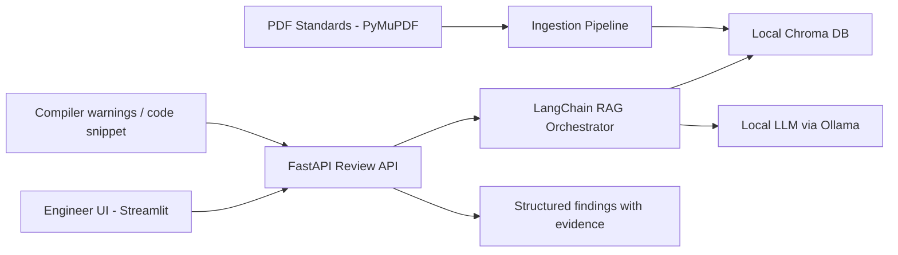

# Secure Code Debugging and Review Assistant

A local-only, offline-first engineering assistant for secure code review, policy checks, and technical explanations in automotive software development contexts.

## Overview

This project is designed for Tier-1 supplier workflows where source code and project artifacts must remain inside a local environment or private network. The system combines:

- a FastAPI backend for review workflows,
- a Streamlit user interface for engineers,
- local retrieval-augmented generation using LangChain + ChromaDB,
- document ingestion of coding standards using PyMuPDF,
- local model execution via Ollama and sentence-transformers.

The engineering use case is based on a MISRA-style automotive coding standard and secure code review scenario.

## Repository Structure

```text
secure-code-debugging-assistant/
├── .gitignore
├── README.md
├── requirements.txt
├── src/
│   ├── api/
│   │   ├── __init__.py
│   │   ├── main.py
│   │   ├── routes/
│   │   │   └── review.py
│   │   ├── middleware/
│   │   │   ├── auth.py
│   │   │   └── logging.py
│   │   └── config.py
│   ├── ui/
│   │   ├── __init__.py
│   │   └── app.py
│   ├── rag/
│   │   ├── __init__.py
│   │   ├── orchestrator.py
│   │   ├── retriever.py
│   │   ├── prompts.py
│   │   └── embeddings.py
│   ├── ingestion/
│   │   ├── __init__.py
│   │   ├── ingest.py
│   │   └── pdf_parser.py
│   └── __init__.py
├── tests/
│   ├── test_api.py
│   ├── test_retrieval.py
│   └── test_ingestion.py
├── docker/
│   ├── Dockerfile
│   └── docker-compose.yml
├── data/
│   ├── standards/
│   └── vector_store/
├── logs/
├── .env.example
└── scripts/
    └── setup_local_models.sh
```

## High-Level Architecture



## Core Design Principles

- Local-only execution: no external service calls.
- Evidence-bound answers: model output must be grounded in retrieved rules and source snippets.
- Review transparency: every finding includes rule citations, evidence excerpts, and confidence.
- Security by default: no secrets in logs; request-level audit logging only.
- Automotive context: MISRA-style checks, secure coding review, and engineering traceability.

## Local Setup

### 1. Create a virtual environment

```bash
python -m venv .venv
source .venv/bin/activate  # Linux/macOS
.venv\Scripts\activate     # Windows PowerShell
```

### 2. Install dependencies

```bash
pip install -r requirements.txt
```

### 3. Start local Ollama model

```bash
ollama pull llama3.1
```

### 4. Run the services

```bash
uvicorn src.api.main:app --reload --host 0.0.0.0 --port 8000
streamlit run src/ui/app.py --server.port 8501
```

## Security & Compliance Guardrails

- No outbound network calls are required for the core workflow.
- All indexing and retrieval are local to the machine or private network.
- Source code remains on-premises and is never transmitted externally.
- Review findings are restricted to retrieved evidence only.

## Next Phase

The repository scaffold is intentionally minimal at this stage. The next steps will add each module in sequence only after your confirmation, starting with the ingestion pipeline and then the RAG orchestrator, API, and UI.
