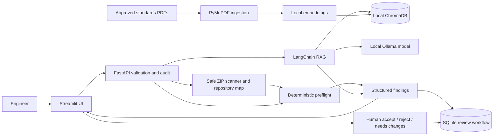

# Automotive Secure Code Debugging and Review Assistant

An offline-first decision-support pilot for **Automotive Engineering AI - Case Study 4**. The application safely inspects an uploaded C/C++ repository ZIP, maps modules and internal dependencies, reviews every supported source file, and accepts compiler/static-analysis or build evidence without intentionally sending proprietary code to a cloud service.

It combines a deterministic local preflight with Retrieval-Augmented Generation (RAG) over approved coding guidance, then records structured findings and a mandatory human disposition in a local audit database.

> This is an educational pilot, not a compiler, a certified static-analysis product, or proof of MISRA compliance. Every output must be validated through compilation, tests, approved tools, and a qualified reviewer.

## Why this project matters

Automotive software teams need faster debugging and more consistent reviews, but source-code confidentiality often prevents use of public AI tools. This project demonstrates a controlled local workflow with:

- local Ollama inference and local SentenceTransformer embeddings;
- ChromaDB retrieval over approved PDF guidance;
- deterministic checks for selected pointer, boundary, resource, and control-flow risks;
- safe in-memory ZIP validation, repository tree construction, and cross-file include mapping;
- authenticated single-user pilot sessions with repository and path-level permission enforcement;
- structured SARIF parsing, performance/complexity observations, and CI-ready SARIF export;
- reuse of explicitly human-accepted historical findings as bounded contextual evidence;
- file, function, line, evidence, severity, confidence, and remediation fields;
- compiler/static-analysis warning and build-log context;
- structured JSON report export;
- SQLite review history, status, reviewer notes, and audit events;
- optional API-key protection and Docker isolation;
- explicit limitations and human approval before a finding is treated as accepted.

## Case-study traceability

| Case Study 4 expectation | Implementation |
|---|---|
| Code explanation and module summaries | Repository-wide function inventory, source-line count, branch/loop counts, calls, and per-module summaries |
| Compiler, static-analysis, and log interpretation | Warning input plus `.txt`, `.log`, `.json`, `.xml`, or `.sarif` evidence upload |
| Candidate defect and root-cause suggestions | Deterministic preflight plus locally hosted LLM review |
| Null-pointer, boundary, resource, and state issues | Conservative local rules with file/function/line evidence |
| MISRA-oriented explanation | RAG over locally indexed, approved PDF content with rule-reference validation |
| Secure-coding recommendations | Structured recommendation and optional CWE mapping |
| Structured findings with evidence and status | JSON report, SQLite record, human disposition, and event history |
| Keep source code inside approved boundaries | Local processing; only hashes and generated review output are persisted |
| Prompt-injection control | Source, warnings, logs, and retrieved text are delimited and treated as untrusted data |
| Auditability and human approval | Request audit logs, immutable review ID, status workflow, reviewer, notes, and timestamps |
| Repository-based review | Safe ZIP upload, all-file C/C++ scan, ignored-directory policy, repository tree, internal dependency graph, and unresolved-include list |
| Authentication and repository permission | Per-run secret API key, authenticated user identity, repository ID and path-prefix allowlist |
| Static-analysis integration | Structured SARIF parser plus compiler/build/runtime evidence normalization |
| Historical approved findings | Accepted review findings are retrieved as human-approved context for later grounded reviews |
| Performance investigation | Complexity estimates, branch/loop totals and dynamic-allocation observations |
| CI/CD integration | `tools/ci_review.py` emits SARIF/JSON and supports a configurable severity gate; example GitHub Actions workflow included |

The pilot deliberately does **not** automatically merge code, approve a release, claim certified compliance, or transmit source code to an external service.

## Architecture



The source text itself is not stored in SQLite. The workflow database stores SHA-256 hashes, result metadata, the generated report, review status, reviewer notes, and audit events.

## Repository layout

```text
.
|-- create_dummy_data.py          # Generates synthetic local test guidance
|-- data/
|   |-- standards/                # Approved input PDFs (ignored by Git)
|   `-- vector_store/             # Generated ChromaDB index (ignored by Git)
|-- demo/                         # Ready-to-run evaluation scenario
|-- docker/                       # API and UI containers
|-- docs/                         # Evaluation and submission guidance
|-- src/
|   |-- analysis/                 # File and repository analyzers
|   |   `-- repository_analyzer.py # Safe ZIP scan, module map, and dependency graph
|   |-- api/main.py               # FastAPI endpoints, validation, and audit
|   |-- ingestion/ingest.py       # PDF extraction, chunking, and indexing
|   |-- rag/orchestrator.py       # Grounded local-LLM review and fallback
|   |-- storage/review_store.py   # SQLite review/disposition repository
|   `-- ui/app.py                 # Streamlit review and history dashboard
|-- tests/                        # API, workflow, and analyzer tests
|-- requirements.txt
`-- run.py                        # Starts backend and frontend together
```

## Quick start

### 1. Create and activate a virtual environment

Windows PowerShell:

```powershell
python -m venv .venv
.venv\Scripts\Activate.ps1
python -m pip install -r requirements.txt
```

macOS/Linux:

```bash
python3 -m venv .venv
source .venv/bin/activate
python -m pip install -r requirements.txt
```

### 2. Prepare the local model

Install Ollama, start its local service, and pull the configured model:

```bash
ollama pull llama3.1
```

The runtime is intentionally offline-only: `all-MiniLM-L6-v2` must be pre-staged in the approved local cache before ingestion. The review path sets `local_files_only=True` and will not download model files. If the model or vector index is absent, the system returns a clearly labeled deterministic fallback.

### 3. Build the local standards index

The included generator creates synthetic guidance for demonstration only:

```bash
python create_dummy_data.py
python src/ingestion/ingest.py
```

For real use, replace the synthetic PDF in `data/standards/` with organization-approved, correctly licensed coding guidance and rebuild the index.

### 4. Run the application

```bash
python run.py
```

- Dashboard: <http://localhost:8501>
- API documentation: <http://localhost:8000/docs>
- Health check: <http://localhost:8000/health>

The app remains demonstrable if Ollama or the RAG index is unavailable: it returns a clearly labeled `deterministic-fallback` report and never fabricates a MISRA rule.

## Five-minute evaluator demo

1. Start the app with `python run.py`.
2. In **Repository ZIP review**, upload `demo/CB.AI.U4AID23109_AutomotiveECURepository_v1.0.zip`.
3. Paste or upload `demo/compiler_warnings.txt` as supporting evidence.
4. Run the review and point out the repository map, module/dependency counts, ignored vendor file, exact file/function/line evidence, severity, CWE mapping, grounded rule section, and limitations.
5. Download the JSON report.
6. Record **Needs changes** with your name and a short validation note.
7. Open **Review history & metrics** and show the persisted disposition.
8. Open <http://localhost:8000/docs> to demonstrate the documented API contract.

Suggested presentation message: the differentiator is not merely “LLM finds bugs”; it is a **local, evidence-bound, auditable workflow with deterministic guardrails and human approval**.

## API summary

| Method | Endpoint | Purpose |
|---|---|---|
| `GET` | `/health` | Liveness check |
| `POST` | `/api/v1/review` | Run local preflight plus grounded review |
| `POST` | `/api/v1/repository-review` | Safely scan and review a complete C/C++ repository ZIP |
| `GET` | `/api/v1/reviews` | List review metadata and status |
| `GET` | `/api/v1/reviews/{review_id}` | Retrieve one review and its audit events |
| `PATCH` | `/api/v1/reviews/{review_id}/disposition` | Record accept/reject/needs-changes decision |
| `GET` | `/api/v1/metrics` | Return local workflow counts |

Example:

```bash
curl -X POST http://localhost:8000/api/v1/review \
  -H "Content-Type: application/json" \
  -d '{
    "file_name": "speed_monitor.c",
    "code_snippet": "int speed; return speed;",
    "compiler_warnings": ["use of uninitialized variable"],
    "build_logs": "warning: speed may be used uninitialized"
  }'
```

If `REVIEW_API_KEY` is configured, include `X-API-Key` in every `/api/v1/` request. The Streamlit UI reads the same environment variable automatically.

## Configuration

Copy `.env.example` values into your approved runtime configuration. `run.py` does not automatically read `.env`; export variables in the shell or configure them in Docker/your process manager.

| Variable | Default | Purpose |
|---|---|---|
| `REVIEW_API_URL` | `http://localhost:8000/api/v1/review` | Streamlit backend URL |
| `REVIEW_API_KEY` | empty | Optional shared API key for pilot access control |
| `REVIEW_AUTH_USER` | `local-reviewer` | Identity associated with the pilot API key |
| `REVIEW_REQUIRE_AUTH` | `false` outside `run.py` | Reject unauthenticated API requests when enabled |
| `REVIEW_REPOSITORY_PERMISSIONS` | empty | JSON repository/path allowlist; `run.py` supplies sample-repository permissions |
| `REVIEW_DATABASE` | `data/reviews.db` | SQLite workflow database |
| `OLLAMA_BASE_URL` | `http://localhost:11434` | Local/private Ollama service |

## Interface accessibility

The dashboard uses an explicit high-contrast light theme. It sets readable foreground and background colors for text, inputs, placeholders, tabs, metrics, alerts, data tables, expanders, and primary, secondary, and download buttons. Restart `python run.py` after changing theme files, then hard-refresh the browser if it has cached an earlier stylesheet.

## Tests

```bash
python -m pytest -q -p no:cacheprovider
```

The 15-test suite covers API health, input validation, response contracts, review persistence, human disposition, metrics, deterministic finding location, repository dependencies, path traversal, symbolic-link rejection, structured SARIF parsing, path authorization, performance observations, and authenticated repository access.

## CI and SARIF

Review a checked-out repository and emit SARIF suitable for a CI code-scanning step:

```powershell
python tools/ci_review.py . --format sarif --output automotive-review.sarif --fail-on High
```

The example `.github/workflows/secure-code-review.yml` demonstrates pull-request execution and SARIF upload. Organizations must approve the runner, permissions, branch protection, and analyzer thresholds before enforcing a release gate.

## Security and governance controls

- Input size, file type, warning count, and filename validation.
- ZIP size, file-count, per-file, total-source, compression-ratio, path-traversal, duplicate-entry, encryption, symbolic-link, binary, and encoding controls.
- No source-code body in application audit logs or the workflow database.
- SHA-256 hashes support traceability without retaining source text.
- Local-only model, embeddings, vector database, and workflow database.
- `run.py` creates an authenticated local session automatically and enforces allowlisted sample repository IDs/path prefixes. Enterprise deployment should replace the pilot key with IAM/OIDC and provider-native repository authorization.
- Source, warnings, logs, and retrieved documents are treated as untrusted prompt data.
- Rule references are rejected if they are not present in the retrieved standard context.
- Low confidence and `No applicable rule found` are enforced when evidence is insufficient.
- Human disposition is separate from model output and recorded with reviewer notes.

## Known limitations and honest next steps

- The regex-based preflight is intentionally narrow and can miss defects or produce false positives.
- The synthetic PDF is not an authoritative MISRA publication and must not be represented as one.
- The pilot reviews supported C/C++ files from an explicitly uploaded ZIP, enforces configured repository/path permissions, parses SARIF evidence, and provides all-file deterministic results. Contextual RAG explanation is bounded to the highest-risk module plus up to 20 related files. Provider-native Git checkout, enterprise OIDC/RBAC, encrypted database storage and production benchmark dashboards remain organization-integration items.
- Findings must be benchmarked against a labeled test corpus before any operational quality claim is made.
- Production rollout should add compiler AST integration (for example, Clang), approved static-analysis tools, signed artifacts, secret management, monitoring, backup, and formal model evaluation.

These limitations are design boundaries, not hidden defects: the system surfaces them in every report to keep evaluation evidence-based.
