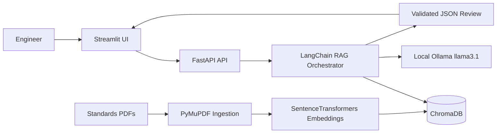

# Secure Code Debugging and Review Assistant

An offline-first engineering assistant for evidence-bound secure code review in automotive software workflows. The application uses a local retrieval-augmented generation pipeline to compare embedded C and C++ code against indexed MISRA-style coding rules without sending proprietary source code to a cloud service.

## Project Overview

The system is designed for Tier-1 suppliers and functional-safety teams that need traceable review findings while keeping source code and engineering artifacts inside a local workstation or private network.

The review workflow is:

1. An engineer submits C/C++ code and optional compiler warnings through the Streamlit dashboard.
2. FastAPI validates the request and records a local audit event.
3. LangChain retrieves relevant coding-standard excerpts from ChromaDB.
4. A local Ollama model produces a structured JSON review grounded in that evidence.
5. The dashboard presents confidence, rule references, root causes, remediation, and source evidence, with an optional JSON compliance report download.

## Architecture



### Technology Stack

- **Streamlit**: enterprise review dashboard and compliance report export.
- **FastAPI**: validated HTTP API with health checks and audit logging.
- **LangChain**: retrieval and local model orchestration.
- **ChromaDB**: local persistent vector database for coding-standard excerpts.
- **SentenceTransformers**: local embeddings using `all-MiniLM-L6-v2`.
- **Ollama**: local LLM runtime using `llama3.1`.
- **PyMuPDF**: PDF text extraction for standards ingestion.
- **Pydantic**: request and response validation, including structured model output.

## Security and Compliance Model

- Source code remains on the local machine or private network.
- The core review workflow does not send source code to external cloud APIs.
- Retrieval is restricted to locally indexed standards documents.
- Findings include rule references and retrieved evidence for traceability.
- API audit logs record request metadata and review outcomes locally.
- The included MISRA-style PDF is synthetic test data and is not an authoritative MISRA publication. Replace it only with standards material your organization is licensed to use.

## Repository Layout

```text
.
├── create_dummy_data.py       # Generates the synthetic standards PDF
├── data/
│   ├── standards/             # Input standards PDFs
│   └── vector_store/           # Generated local ChromaDB data, ignored by Git
├── docker/                    # Optional container configuration
├── requirements.txt           # Python dependencies
├── run.py                     # Starts API and UI together
├── src/
│   ├── api/main.py            # FastAPI application and endpoints
│   ├── ingestion/ingest.py    # PDF extraction, chunking, and indexing
│   ├── rag/orchestrator.py    # Retrieval and structured local-LLM review
│   └── ui/app.py              # Streamlit dashboard
└── tests/test_api.py          # API endpoint tests
```

## Prerequisites

- Python 3.11 or 3.12
- Ollama installed and available on `PATH`
- At least 8 GB of available disk space for the local model and embedding cache
- Windows PowerShell, macOS/Linux shell, or an equivalent terminal

## Setup

### 1. Create and activate a virtual environment

Windows PowerShell:

```powershell
python -m venv .venv
.venv\Scripts\Activate.ps1
```

macOS/Linux:

```bash
python3 -m venv .venv
source .venv/bin/activate
```

### 2. Install Python requirements

```bash
python -m pip install -r requirements.txt
```

### 3. Pull the local language model

```bash
ollama pull llama3.1
```

Ensure the Ollama service is running before submitting a review.

### 4. Generate local test standards

The repository includes a synthetic MISRA-style document for local pipeline testing:

```bash
python create_dummy_data.py
```

For production use, place organization-approved standards PDFs in `data/standards/` instead.

### 5. Build the ChromaDB index

```bash
python src/ingestion/ingest.py
```

The ingestion process extracts PDF text, creates overlapping chunks, computes local embeddings, and persists the collection under `data/vector_store/`.

## Execution

Start the FastAPI backend and Streamlit dashboard concurrently:

```bash
python run.py
```

Open the following URLs:

- Dashboard: <http://localhost:8501>
- API: <http://localhost:8000>
- API documentation: <http://localhost:8000/docs>
- Health check: <http://localhost:8000/health>

## API Example

```bash
curl -X POST http://localhost:8000/api/v1/review \
  -H "Content-Type: application/json" \
  -d '{
    "code_snippet": "int speed; return speed;",
    "compiler_warnings": ["use of uninitialized variable"]
  }'
```

The response is a validated JSON object containing `review_summary`, `candidate_root_causes`, `suggested_remediation`, `rule_reference`, `source_evidence`, `confidence`, and optional retrieved context.

## Testing

Run the API tests with the local virtual environment active:

```bash
python -m pytest tests -q
```

The review endpoint test mocks the RAG orchestrator, so it validates FastAPI request and response behavior without requiring a running Ollama model.

## Operational Notes

- Generated ChromaDB files are excluded from version control.
- The first embedding initialization downloads the configured SentenceTransformers model into the local model cache.
- Review latency depends on the local hardware and Ollama model runtime.
- Do not place proprietary standards documents or source code in public repositories.
